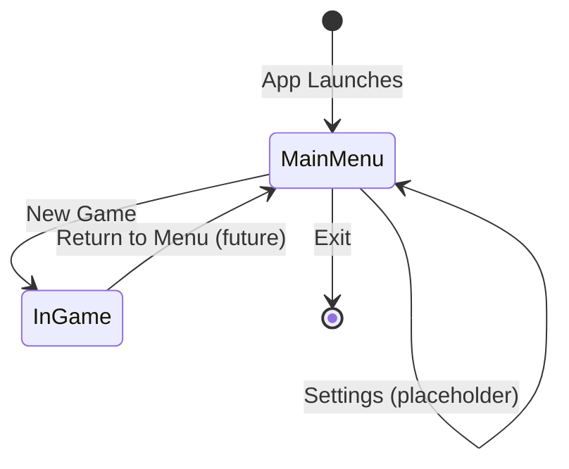

# Data Model: Main Menu Scene

## Entities

### MenuButton
Represents a single interactive button on the main menu.

| Field     | Type            | Description                                    |
|-----------|-----------------|------------------------------------------------|
| label     | string          | Display text shown on the button               |
| action    | MenuAction enum | The action triggered on click                  |
| enabled   | bool            | Whether the button is interactive              |

### MenuAction (Enum)
Defines the possible actions a menu button can trigger.

| Value     | Description                                          |
|-----------|------------------------------------------------------|
| NewGame   | Loads the first gameplay scene                       |
| LoadGame  | Placeholder — shows "Coming Soon" feedback           |
| Settings  | Placeholder — shows "Coming Soon" feedback           |
| Exit      | Terminates the application                           |

### GameState (Enum)
Tracks the current high-level state of the application.

| Value     | Description                                          |
|-----------|------------------------------------------------------|
| MainMenu  | Player is on the main menu screen                    |
| InGame    | Player is actively in a gameplay level               |
| Paused    | Game is paused (future use)                          |

## State Transitions

## Relationships
- `MainMenuController` owns a collection of `MenuButton` references.
- `GameManager` (singleton) manages `GameState` transitions and scene loading.
- `MainMenuController` delegates scene operations to `GameManager`.
