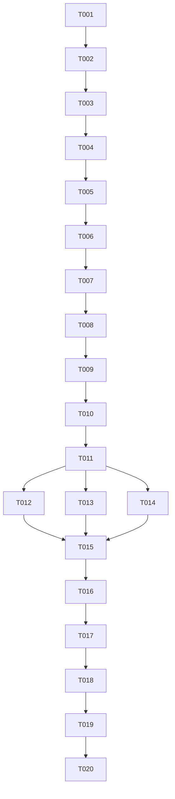

# Tasks: Main Menu Scene

**Feature**: Main Menu Scene (1-main-menu)
**Total Tasks**: 20
**Estimated Phases**: 5

---

## Phase 1: Setup (Project Foundation)

> **Goal**: Establish the folder structure, create the MainMenu scene, and configure Build Settings.

- [x] T001 Create folder structure: `Assets/_Project/Scripts/MainMenu/`, `Assets/_Project/Scripts/Core/`, `Assets/_Project/Scenes/`, `Assets/_Project/UI/`
- [x] T002 Create empty Unity scene file `Assets/_Project/Scenes/MainMenu.unity`
- [x] T003 Add `MainMenu` scene to Unity Build Settings as scene index 0 (default launch scene)

---

## Phase 2: Foundational (Core Systems)

> **Goal**: Build the reusable core systems that all future features will depend on.

- [x] T004 Create `GameState` enum (MainMenu, InGame, Paused) in `Assets/_Project/Scripts/Core/GameState.cs`
- [x] T005 Create `MenuAction` enum (NewGame, LoadGame, Settings, Exit) in `Assets/_Project/Scripts/Core/MenuAction.cs`
- [x] T006 Create `GameManager.cs` singleton in `Assets/_Project/Scripts/Core/GameManager.cs` with scene loading and quit methods

---

## Phase 3: [US1] Main Menu UI Layout & Styling

> **Goal**: Build the visual UI layout with all 4 buttons, styled with a dark technical theme.
> **Story**: As a player, I want to see a clean menu with 4 options when I launch the game.

- [x] T007 [US1] Create `MainMenu.uxml` UI layout with vertical container and 4 buttons (New Game, Load Game, Settings, Exit) in `Assets/_Project/UI/MainMenu.uxml`
- [x] T008 [US1] Create `MainMenu.uss` stylesheet with dark theme: dark background (#0a0a0a), light text (#e0e0e0), monospaced font, centered layout in `Assets/_Project/UI/MainMenu.uss`
- [x] T009 [US1] Add hover effects in USS: button background lightens on hover, subtle scale transition in `Assets/_Project/UI/MainMenu.uss`
- [x] T010 [US1] Add a UIDocument component to the MainMenu scene and attach `MainMenu.uxml` as the source asset

---

## Phase 4: [US2] Button Logic & Actions

> **Goal**: Wire up all 4 buttons to their respective actions.
> **Story**: As a player, I want each button to perform its intended action (start game, exit, etc.).

- [x] T011 [US2] Create `MainMenuController.cs` in `Assets/_Project/Scripts/MainMenu/MainMenuController.cs` — query UI buttons by name and register click callbacks
- [x] T012 [US2] Implement "New Game" button handler: calls `GameManager.LoadScene("GameplayScene")` or logs "Loading gameplay..." if scene doesn't exist yet
- [x] T013 [US2] Implement "Exit" button handler: calls `Application.Quit()` and logs in Editor mode since Quit doesn't work in Play Mode
- [x] T014 [US2] Implement "Load Game" and "Settings" placeholder handlers: show a "Coming Soon" label in the UI or log message
- [x] T015 [US2] Attach `MainMenuController.cs` to a GameObject in the MainMenu scene

---

## Phase 5: Polish & Cross-Cutting Concerns

> **Goal**: Finalize the scene, run all skill evaluation gates, and prepare for push.

- [x] T016 Test all 4 buttons in Unity Play Mode — verify correct behavior for each action
- [x] T017 Test UI responsiveness at 1920×1080 and 1280×720 resolutions — verify buttons remain centered
- [x] T018 Run **Skill Evaluation Gate** — Apply all 12+ skills (see Evaluation Matrix below) and document results in `specs/1-main-menu/evaluation-report.md`
- [x] T019 Fix any issues identified by skill evaluation gates
- [x] T020 Commit all changes to branch `1-main-menu` and push to GitHub

---

## Dependencies

## Parallel Opportunities

| Parallel Group | Tasks | Why Parallel |
|---------------|-------|--------------|
| Enums | T004, T005 | Independent files, no shared dependencies |
| Button Handlers | T012, T013, T014 | Independent methods in same class, different files touched |

---

## Skill Evaluation Matrix (T018)

This is the quality gate that runs during Task T018. Each skill evaluates the implementation against its criteria:

| # | Skill | Evaluation Focus | Pass Criteria |
|---|-------|-----------------|---------------|
| 1 | **game-development** | State Machine pattern for menu states | GameState enum used, proper state transitions |
| 2 | **clean-code** | Function size, naming, SRP | All functions < 20 lines, intention-revealing names |
| 3 | **plan-writing** | Task specificity and verification | Each task has clear "done" criteria |
| 4 | **architect-review** | Separation of concerns | UI (UXML/USS) separated from logic (C#), GameManager isolated |
| 5 | **code-review-excellence** | Correctness and maintainability | No dead code, clear structure, consistent style |
| 6 | **security-review** | No hardcoded secrets, safe quit | No exposed internals, Application.Quit guarded |
| 7 | **performance-optimizer** | No per-frame allocations | No code in Update() unless necessary, efficient UI queries |
| 8 | **find-bugs** | Null checks, missing refs | All UI element queries have null checks |
| 9 | **production-code-audit** | Overall code grade | Grade B+ or higher |
| 10 | **codebase-audit-pre-push** | Junk files, .gitignore, docs | No junk, .gitignore correct, README exists |
| 11 | **context-driven-development** | Context artifacts maintained | spec.md, plan.md, tasks.md all up to date |
| 12 | **comprehensive-review** | Multi-dimensional final pass | All dimensions (quality, arch, security, perf) reviewed |
| 13 | **error-debugging** | Error handling quality | Graceful fallbacks for missing scenes, clear error logs |
| 14 | **project-development** | Minimal architecture, iteration | No over-engineering, clean pipeline |

---

## Implementation Strategy

### MVP Scope
- **Phase 1-4** (T001-T015): Core menu with all 4 buttons working.
- This is the minimum deliverable.

### Incremental Delivery
1. **Phase 1**: Folder structure + scene → Can open scene in Editor.
2. **Phase 2**: Core enums + GameManager → Foundation ready.
3. **Phase 3**: UI visible → Can see 4 buttons in Play Mode.
4. **Phase 4**: Buttons work → Full functionality.
5. **Phase 5**: Quality assured → Ready for push.

### Suggested MVP
Complete through **T015** for a functional Main Menu. **T016-T020** are verification and polish.
