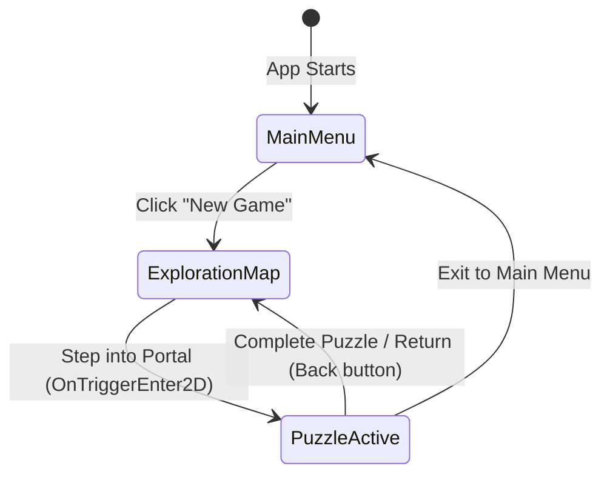

# Data Model: Vertical Map & Player Controller

This document outlines the logical structures, entities, and states for the player exploration map and scene traversal.

---

## Entities

### PlayerState (C# Struct / Class State)
Tracks the runtime state and movement properties of the player character.

| Field | Type | Description |
| :--- | :--- | :--- |
| MoveSpeed | float | Maximum horizontal velocity. |
| JumpForce | float | Upward force applied during jump start. |
| GravityScale | float | Natural physics gravity scale when moving. |
| IsGrounded | bool | True if character is touching ground layer. |
| IsClimbing | bool | True if character is climbing a ladder. |

### PortalController (MonoBehaviour)
Represents a doorway to a logic puzzle.

| Field | Type | Description |
| :--- | :--- | :--- |
| PortalID | string | Unique identifier for this logic gate challenge. |
| TargetSceneName | string | Scene name of the logic puzzle loaded on entry. |
| IsLocked | bool | If true, portal is visually inactive and blocks entry. |
| IsCompleted | bool | If true, displays success indicators (green badge). |

### GameState Transitions (Extended)
Updates the global `GameState` to support gameplay integration.

| Value | Description |
| :--- | :--- |
| MainMenu | On the Main Menu screen. |
| ExplorationMap | Navigating the vertical map. |
| PuzzleActive | Solving a specific logic gate puzzle. |

---

## State Transitions & Traversals

---

## Scene Relationships
- `GameManager` (singleton) tracks the overall `GameState` and handles scene loading.
- `PlayerController` interacts with `PortalController` using Unity's `OnTriggerEnter2D` physics callback.
- `CameraController2D` references the `PlayerController` transform to smooth lerp its position.
