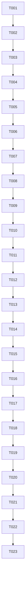

# Tasks: Vertical Map & Player Controller

**Feature**: Vertical Map & Player Controller (2-map-player-controller)
**Total Tasks**: 23
**Estimated Phases**: 7

---

## Phase 1: Setup (Project Foundation)

> **Goal**: Create the new map scene file and update the project’s scene configurations.

- [ ] T001 Create empty Unity scene file `Assets/Scenes/ExplorationMap.unity`
- [ ] T002 Add `ExplorationMap` scene to Unity Build Settings at index 1 in `ProjectSettings/EditorBuildSettings.asset`

---

## Phase 2: Foundational (Core Systems)

> **Goal**: Wire up the GameManager to support transition to the Exploration map.

- [ ] T003 Update `GameState` enum to include `ExplorationMap` state in `Assets/Scripts/Managers/GameState.cs`
- [ ] T004 Update `GameManager.cs` to add a load transition to the `ExplorationMap` scene in `Assets/Scripts/Managers/GameManager.cs`

---

## Phase 3: [US1] Vertical Platform Map Setup

> **Goal**: Construct the vertical scrolling platform environment using asset tiles.
> **Story**: As a player, I want to explore a vertical environment containing platforms, ladders, and background visuals.

- [ ] T005 [US1] Create 2D Grid with Platforms, Ladders, and Background Tilemap layers in `Assets/Scenes/ExplorationMap.unity`
- [ ] T006 [P] [US1] Slices and configure sprites for Tileset sheets in `Assets/BayatGames/Free Platform Game Assets/Tiles/`
- [ ] T007 [US1] Paint platforms and vertical climb paths (ladders) on the Tilemaps in `Assets/Scenes/ExplorationMap.unity`
- [ ] T008 [US1] Add a Tilemap Collider 2D and Composite Collider 2D to the Platforms tilemap layer in `Assets/Scenes/ExplorationMap.unity`

---

## Phase 4: [US2] Player Movement & Physics

> **Goal**: Implement physical 2D controls for horizontal movement, jumping, and climbing.
> **Story**: As a player character, I want to run, jump, and climb ladders smoothly to navigate the level design.

- [ ] T009 [US2] Create Player GameObject with Rigidbody2D, CapsuleCollider2D, and GroundCheck layers in `Assets/Scenes/ExplorationMap.unity`
- [ ] T010 [US2] Create script `PlayerController.cs` in `Assets/Scripts/Gameplay/PlayerController.cs`
- [ ] T011 [US2] Implement horizontal WASD/Arrow controls with physics acceleration/deceleration in `Assets/Scripts/Gameplay/PlayerController.cs`
- [ ] T012 [US2] Implement jump physics and ground verification in `Assets/Scripts/Gameplay/PlayerController.cs`
- [ ] T013 [US2] Implement climbing logic that disables gravity when the player overlaps with a ladder tile trigger in `Assets/Scripts/Gameplay/PlayerController.cs`
- [ ] T014 [US2] Setup basic Animator controller and animate character movement states in `Assets/Scenes/ExplorationMap.unity`

---

## Phase 5: [US3] Smooth Camera Tracking

> **Goal**: Implement smooth camera tracking that locks within map bounds.
> **Story**: As a player, I want the camera to follow me smoothly so I can see where I am going.

- [ ] T015 [US3] Create camera tracking script `CameraController2D.cs` in `Assets/Scripts/Gameplay/CameraController2D.cs`
- [ ] T016 [US3] Attach `CameraController2D` to Main Camera and assign player transform in `Assets/Scenes/ExplorationMap.unity`
- [ ] T017 [US3] Implement boundary clamping (minimum/maximum X and Y values) in `Assets/Scripts/Gameplay/CameraController2D.cs`

---

## Phase 6: [US4] Portal Traversals

> **Goal**: Add portals that load respective logic puzzle scenes on collision.
> **Story**: As a player, I want to walk into a portal to launch a logic puzzle challenge.

- [ ] T018 [US4] Create logic puzzle portal script `PortalController.cs` in `Assets/Scripts/Gameplay/PortalController.cs`
- [ ] T019 [US4] Place portal GameObjects with trigger colliders and custom target scene properties in `Assets/Scenes/ExplorationMap.unity`
- [ ] T020 [US4] Update `MainMenuController.cs` to load the `ExplorationMap` scene on clicking "New Game" in `Assets/Scripts/UI/MainMenuController.cs`

---

## Phase 7: Polish & Verification

> **Goal**: Conduct gameplay reviews and verify implementation quality.

- [ ] T021 Test and verify player platforming feel, ladder transition, and collision boundaries in `Assets/Scenes/ExplorationMap.unity`
- [ ] T022 Verify automatic scene load transitions on entering portal gateways in `Assets/Scenes/ExplorationMap.unity`
- [ ] T023 Run **Skill Evaluation Gates** and document findings in `specs/2-map-player-controller/evaluation-report.md`

---

## Dependencies

---

## Parallel Opportunities

| Parallel Group | Tasks | Why Parallel |
|---|---|---|
| Assets & Grid Setup | T006, T007 | Asset slicing can occur in parallel to grid/scene objects configuration |
| Scene Configuration | T016, T019 | Standard scene component bindings can occur in parallel |

---

## Skill Evaluation Matrix (T023)

This gate runs during T023 to verify all technical and quality criteria:

| # | Skill | Evaluation Focus | Pass Criteria |
|---|---|---|---|
| 1 | **game-development** | Physics-based movement & frame-rate independence | Use of `FixedUpdate` for physics modifications, proper grounding checks |
| 2 | **clean-code** | Class boundaries, SRP | Input logic isolated from movement calculation, enums utilized |
| 3 | **plan-writing** | Task detail, path references | Every task mentions target file path, is individually testable |
| 4 | **performance-optimizer** | Update allocations, component caching | No `GetComponent` inside Update/FixedUpdate loops |
| 5 | **find-bugs** | Collision glitch checks, out-of-bounds bounds | Boundary clamps applied, composite colliders verify no seam issues |

---

## Implementation Strategy

### MVP Scope
Complete phases 1 through 6 to implement the vertical platform level, movement mechanics, tracking, and trigger transitions.

### Suggested MVP
Complete up to **T020** to have a fully testable exploration loop. T021-T023 are verification and quality audit steps.
